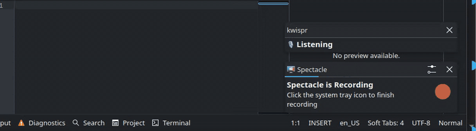

# Kwispr

**Toggle voice dictation for Linux / Wayland / KDE Plasma via OpenAI Whisper.** Press your hotkey → speak → press it again → text is copied to your clipboard and auto-pasted into the focused window.

  



## Why

- **Stateless** — ~250 lines of bash, no daemons of our own, no GUI. The KDE Shortcut runs the script, the script exits. Next press runs it again.
- **Clipboard first, auto-paste second** — the transcript always goes into the clipboard via `wl-copy`. On top of that, `ydotool` simulates Ctrl+V in the focused window for zero-friction pasting. If the focus was elsewhere, the text is still one Ctrl+V away.
- **Works anywhere on Wayland** — VS Code, Claude Code CLI, browser, Slack, terminal. `ydotool` goes through `/dev/uinput` at the kernel level, bypassing Wayland's input-injection restrictions.
- **Layout-independent** — sends raw Ctrl+V keycodes; apps pull Unicode text from the clipboard. Russian, English, and mixed text all work the same.
- **Three-stage audio feedback** — pip-pip-pip on start, pup-pup-pup on stop, ding-dong when the transcript is ready. You always know what's happening without looking.
- **Persistent status bubble** — one notification transforms Listening → Processing → Ready, never stacks.
- **Never loses your speech** — on API/network failure the WAV is preserved and a retry command is copied into your clipboard.
- **Whisper hallucination filter** — a post-processing regex scrubs the subtitle artifacts Whisper leaks on short audio («Редактор субтитров», «Subtitles by», «Thanks for watching»).

**Tested on:** Kubuntu 25.10 + KDE Plasma 6 + PipeWire. Should work on any Linux with Wayland + `wl-clipboard` + `libnotify-bin`.

## Architecture

```
Hotkey (KDE Custom Shortcut)
  └─ kwispr.sh toggle
       ├─ start: ffmpeg -f pulse → ~/.cache/kwispr/TS.wav (via FIFO)
       │         notify-send "🎙 Listening" (persistent)
       └─ stop:  write 'q' to FIFO → ffmpeg flushes WAV
                 notify-send replace → "⏳ Processing"
                 curl POST $KWISPR_API_URL
                   model=$KWISPR_MODEL, backend=$KWISPR_BACKEND
                 sed-filter subtitle hallucinations
                 wl-copy $transcript                        (always)
                 ydotool key 29:1 47:1 47:0 29:0            (Ctrl+V, if enabled)
                 notify-send replace → "✅ Pasted" or "Ready (in clipboard)"
```

**No daemons of our own.** The script is stateless, launched from the KDE Shortcut and exits after each press. State lives in lockfiles under `~/.cache/kwispr/`. The only persistent component is the optional `ydotoold` systemd service (for auto-paste).

## Dependencies

| Package | Purpose | Source |
|---|---|---|
| `ffmpeg` | record from pulse (via FIFO + 'q' for proper flush) | APT |
| `curl` | OpenAI API request | APT |
| `jq` | parse JSON response | APT |
| `wl-clipboard` | `wl-copy` for clipboard | APT |
| `libnotify-bin` | `notify-send` for the persistent status bubble | APT |
| `pipewire-pulse` | pulse-compat layer on PipeWire | ships with Kubuntu 25.10 |
| `ydotool` v1.0.4 (optional) | auto-paste Ctrl+V via `/dev/uinput` | GitHub release → `~/.local/bin/` |

**Why `ydotool` is downloaded from GitHub instead of APT:** the Ubuntu APT version is an ancient 0.1.8 without the `key` command or daemon. We need 1.0.4+.

## Install

```bash
git clone git@github.com:MaksBoi/kwispr.git
cd kwispr
./setup.sh                       # installs deps, prompts for ydotool install
cp .env.example .env
chmod 600 .env
# Put your API key/backend settings into .env
```

When `ydotool` is installed by `setup.sh`:

- v1.0.4 downloaded into `~/.local/bin/`
- udev rule `/etc/udev/rules.d/80-uinput.rules` makes `/dev/uinput` owned by the `input` group
- your user is added to the `input` group (**re-login required** after this)
- system-level systemd service `/etc/systemd/system/ydotoold.service` is created

After re-login: `systemctl status ydotoold` should show `active (running)`.

## Binding a hotkey

Pick any key or combination — a regular `F5`, a modifier combo, a multimedia key. Bind it through KDE:

1. **System Settings → Shortcuts → Shortcuts → Add New → Command/URL Shortcut**
2. **Trigger:** press the key (or combo) you want to use
3. **Action:** `<absolute_path>/kwispr.sh`
4. **Apply**

### Multimedia / Fn-row keys

Some keyboards have a "multimedia mode" that remaps F-keys to send different keysyms (e.g. Meta+H instead of F5). KDE won't capture them as plain F-keys — you need to press them in that mode when setting the trigger. If KDE reports unusual keysyms, capture the real one first:

```bash
sudo apt install -y wev
wev
```

Press the key inside the `wev` window, read the `sym ...` line, close.

### Multiple keyboard layouts

The same physical key can send different keysyms depending on the active layout (e.g. `Meta+H` on en vs. `Meta+Р` on ru). Add a second trigger for each layout — all pointing to the same script.

## Usage

| Step | What happens |
|---|---|
| Press hotkey | Recording starts. Persistent "🎙 Listening" notification. |
| (speak) | ffmpeg writes to `~/.cache/kwispr/TS.wav` |
| Press hotkey again | ffmpeg shuts down gracefully (FIFO + 'q' → valid WAV). Notification → "⏳ Processing" |
| ~1-3 s | Whisper transcribes, hallucination filter cleans subtitle artifacts |
| done | Text lands in the clipboard, and ydotool simulates Ctrl+V in the focused window. Notification → "✅ Pasted" (auto-paste worked) or "Ready (in clipboard)" (paste manually with Ctrl+V) |

The text is **always** in the clipboard — even if the wrong window was focused, or auto-paste is disabled, Ctrl+V still works.

Minimum 1 second of audio is required — otherwise "⚠ Too short" (Whisper reliably hallucinates on <1s).

## Commands

- `kwispr.sh` (or `kwispr.sh toggle`) — start/stop recording
- `kwispr.sh retry <path.wav>` — retry transcription of an old WAV file

## Configuration (`.env`)

```bash
KWISPR_BACKEND=openai-transcriptions
KWISPR_API_URL=https://api.openai.com/v1/audio/transcriptions
KWISPR_MODEL=whisper-1
KWISPR_API_KEY=sk-...            # required for OpenAI/OpenRouter; optional for local servers
KWISPR_LANGUAGE=                 # empty = autodetect (ok for mixed ru/en); or 'ru', 'en'
KWISPR_AUTOPASTE=1               # 1 = auto Ctrl+V; 0 = clipboard only
KWISPR_SOUNDS=1                  # 1 = audio cues; 0 = silent
# KWISPR_SOUND_START=/path.wav   # optional custom sounds
# KWISPR_SOUND_STOP=/path.wav
# KWISPR_SOUND_READY=/path.wav
```

### Alternative transcription backends

Kwispr defaults to OpenAI Whisper, but the transcription call is configurable. It supports OpenAI-compatible `/v1/audio/transcriptions` backends and OpenRouter's `/chat/completions` audio-input API.

**OpenAI (default):**

```bash
KWISPR_API_URL=https://api.openai.com/v1/audio/transcriptions
KWISPR_MODEL=whisper-1
KWISPR_API_KEY=sk-...
```

**OpenRouter audio input:**

OpenRouter processes audio inputs through chat completions with base64 `input_audio` content. Use an audio-capable model such as Gemini Flash:

```bash
KWISPR_BACKEND=openrouter-chat
KWISPR_API_URL=https://openrouter.ai/api/v1/chat/completions
KWISPR_MODEL=google/gemini-2.5-flash
KWISPR_API_KEY=sk-or-...
# Optional app attribution headers:
KWISPR_HTTP_REFERER=https://github.com/MaksBoi/kwispr
KWISPR_APP_TITLE=kwispr
KWISPR_AUDIO_FORMAT=wav
KWISPR_PULSE_SOURCE=default
KWISPR_TRANSCRIPTION_PROMPT='Transcribe this audio exactly as spoken. The speech may be Russian, English, or mixed. Do not translate. Return only the transcript.'
```

**Local/offline STT (no cloud key):**

Kwispr can use a local OpenAI-compatible STT endpoint. In local mode, no OpenAI or OpenRouter key is required: leave `KWISPR_API_KEY` empty and point `KWISPR_API_URL` at the local server.

For quick wiring tests, the legacy Python stub exposes `GET /health` and `POST /v1/audio/transcriptions` and returns `{"text":"[stub transcript]"}`; it does not perform real inference:

```bash
./kwispr-local-stt-server.py --host 127.0.0.1 --port 9000
```

For real local inference, build and run the Rust runtime after downloading a catalog model:

```bash
./kwispr-models.py download gigaam-v3-e2e-ctc
cd rust-local-stt
cargo build --release
KWISPR_MODEL_DIR=~/.local/share/kwispr/models \
  ./target/release/kwispr-local-stt --host 127.0.0.1 --port 9000 \
  --catalog ../models/local-stt-catalog.json
```

Then configure `.env` without changing `kwispr.sh`:

```bash
KWISPR_BACKEND=openai-transcriptions
KWISPR_API_URL=http://127.0.0.1:9000/v1/audio/transcriptions
KWISPR_MODEL=gigaam-v3-e2e-ctc
KWISPR_API_KEY=
KWISPR_LANGUAGE=ru
```

### Local STT model catalog

Kwispr includes a local/offline STT model catalog and a small downloader helper:

```bash
./kwispr-models.py list
./kwispr-models.py download gigaam-v3-e2e-ctc
./kwispr-models.py verify gigaam-v3-e2e-ctc
```

Models install under `~/.local/share/kwispr/models` by default. Set `KWISPR_MODEL_DIR=/path/to/models` or pass `--model-dir /path/to/models` to use another location. Downloads are SHA256-verified before install; repeated runs skip models that are already valid.

The initial catalog tracks Handy-compatible model artifacts for GigaAM v3, Parakeet V3, and Whisper Large v3 Turbo; the Rust runtime loads these models when its native dependencies are available. See [`docs/local-stt.md`](docs/local-stt.md) for local runtime details and limitations.

Recommended starting points:

| Dictation need | Recommended model | `.env` model id | Notes |
|---|---|---|---|
| Russian | GigaAM v3 | `gigaam-v3-e2e-ctc` | Smallest catalog model and the best default for Russian-only dictation. |
| Mixed Russian/English | Parakeet V3 or Whisper Large v3 Turbo | `parakeet-tdt-0.6b-v3` or `whisper-large-v3-turbo` | Parakeet is faster/lighter; Whisper Turbo is the broader multilingual fallback. |
| English low latency | Parakeet now; Moonshine-class models later | `parakeet-tdt-0.6b-v3` | The current catalog does not include Moonshine. Treat Moonshine-class English options as future catalog candidates. |

## Archive and rotation

All recordings + transcripts are kept in `~/.cache/kwispr/`. Files older than 30 days are deleted automatically on each run (only `*.wav` and `*.txt`, service files are not touched).

On API failure:
- the WAV stays in the archive
- `last-failed.txt` holds the retry command
- the retry command is also copied into the clipboard (paste it into a terminal)

## Why these design choices (best practices)

**Why FIFO + 'q' instead of SIGTERM for ffmpeg:**
`ffmpeg -f pulse` on Wayland/PipeWire sometimes ignores SIGINT ([ffmpeg trac #8369](https://trac.ffmpeg.org/ticket/8369)) and can leave a 0-byte WAV on SIGTERM (no trailer written). The documented graceful shutdown is writing `q` to stdin — done here via a FIFO held open by a background `sleep`.

**Why ydotool (not wtype / xdotool):**
- `wtype` doesn't work on KDE Plasma Wayland — KWin doesn't support the virtual-keyboard protocol ([reference](https://gist.github.com/danielrosehill/d3913d4c8cc69acaf3ee7772771c2f1d))
- `xdotool` is X11 only
- `ydotool` uses `/dev/uinput` at the kernel level, bypassing Wayland's input injection restrictions

**Why keyboard layouts don't break:**
ydotool sends **raw keycodes** (29=Ctrl, 47=V) — a stable hotkey regardless of layout. The target app pulls the text from `wl-copy`'s clipboard, where the correct Unicode already lives. We never "type" the text through ydotool — so the known [unicode-type bug](https://github.com/ReimuNotMoe/ydotool/issues/249) doesn't apply.

**Prompt-less transcription:**
Whisper was tested with various prompts. A bilingual prompt (e.g. "Voice dictation. Голосовая диктовка.") made the model occasionally **translate** speech into the prompt's language instead of transcribing as-is. We removed the prompt entirely — Whisper transcribes what it hears, and known hallucinations («Редактор субтитров», «Subtitles by ...», «Thanks for watching») are scrubbed by a post-processing regex.

Plus a minimum 1 second of audio before the API call (below that — immediate "Too short", saving an API round-trip).

## Troubleshooting

| Symptom | Cause | Fix |
|---|---|---|
| "No .env" | Config not created | `cp .env.example .env; chmod 600 .env` |
| "KWISPR_API_KEY/OPENAI_API_KEY not set" | Placeholder instead of a key for cloud mode | Put a real `sk-...` or `sk-or-...` into `.env`; for local mode, set `KWISPR_API_URL=http://127.0.0.1:9000/v1/audio/transcriptions` and leave `KWISPR_API_KEY=` empty |
| "Too short" on normal speech | pulse hadn't opened yet (0.05s sleep too short) | Increase the `sleep` in `start_recording` |
| Records but doesn't paste | ydotoold not running or `/dev/uinput` not accessible | `systemctl status ydotoold` + `ls -la /dev/uinput` (should be `crw-rw---- root input`) |
| Pasted into wrong window | Focus was elsewhere when you pressed the hotkey | Place cursor in the target **before** pressing the hotkey to stop |
| Local mode returns `[stub transcript]` | The Python stub server is running | Use the Rust runtime for real local inference; the stub is only for wiring tests |
| `curl: (7) Failed to connect` or local API error | Local STT server is not running or wrong port | Start `kwispr-local-stt-server.py` or `rust-local-stt/target/release/kwispr-local-stt`, then check `curl http://127.0.0.1:9000/health` |
| `unknown model` / `model ... is not installed` | `.env` model id is not in the catalog or artifact has not been downloaded | Run `./kwispr-models.py list`, then `./kwispr-models.py download <model-id>` and verify `KWISPR_MODEL_DIR` |
| `unsupported engine_type` or runtime load failure | The runtime was built without a usable local engine/dependency for that catalog entry | Try another catalog model, rebuild `rust-local-stt`, or use cloud mode until the local runtime dependency is available on your system |
| Wrong language or unsupported language in local mode | Selected model does not support that language or ignores `KWISPR_LANGUAGE` | Use GigaAM for Russian, Parakeet/Whisper for mixed ru/en, or leave `KWISPR_LANGUAGE=` empty for autodetect where supported |
| CPU/GPU fallback is unavailable | Current local runtime does not expose a GPU/CPU selection switch | Use the default CPU/native backend path, or fall back to OpenAI/OpenRouter cloud mode if local native runtime is unavailable |
| "API 401" | Wrong API key | Verify on platform.openai.com; local mode should not send a cloud key |
| "API 429" | Rate limit / billing | Top up OpenAI balance |
| Empty clipboard after ✅ | Wayland clipboard glitch | `systemctl --user restart xdg-desktop-portal` |
| No notifications | `libnotify-bin` missing | `sudo apt install libnotify-bin` |
| Recording doesn't start | ffmpeg can't see mic | `pactl list sources short` — check default |
| Green mic LED stays on after a crash | Stale ffmpeg process | `pkill -f "ffmpeg.*pulse"` |

### Disable auto-paste

In `.env`: `KWISPR_AUTOPASTE=0`. Text stays in the clipboard — paste manually with Ctrl+V.

### Remove ydotool entirely

```bash
sudo systemctl disable --now ydotoold
sudo rm /etc/systemd/system/ydotoold.service
sudo rm /etc/udev/rules.d/80-uinput.rules
sudo gpasswd -d "$USER" input
rm ~/.local/bin/ydotool ~/.local/bin/ydotoold
```

Then set `KWISPR_AUTOPASTE=0` in `.env`.

## Not in scope (yet)

- Bundled local Whisper runtime (use a separate OpenAI-compatible local server instead)
- Push-to-talk mode (toggle only)
- GUI / tray icon (the single persistent notification is enough)

> Note: KDE Custom Shortcuts can't bind to mouse buttons directly. If you want a mouse-button trigger, use a tool like `input-remapper` to remap the button to a keyboard shortcut, then bind that shortcut to kwispr.

## License

MIT — see [LICENSE](LICENSE).
